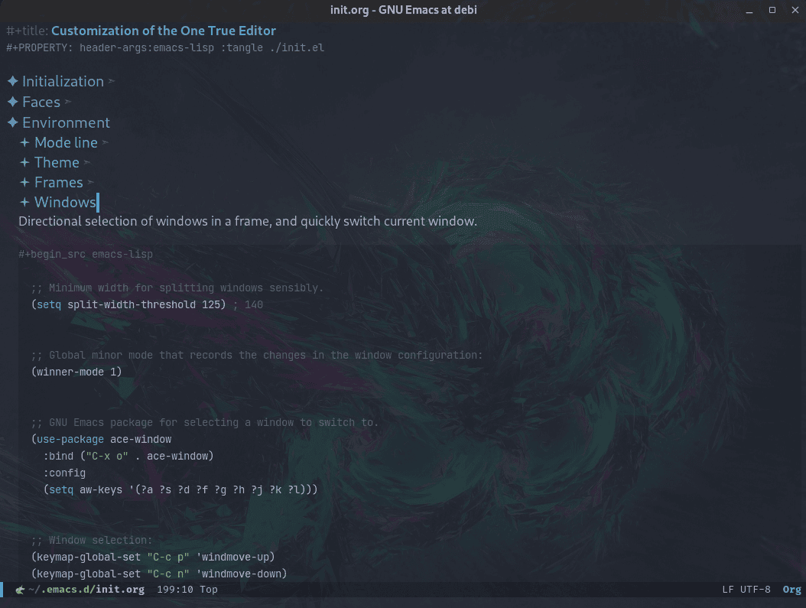
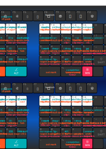
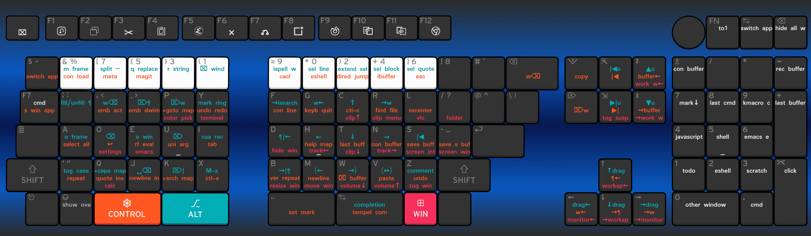
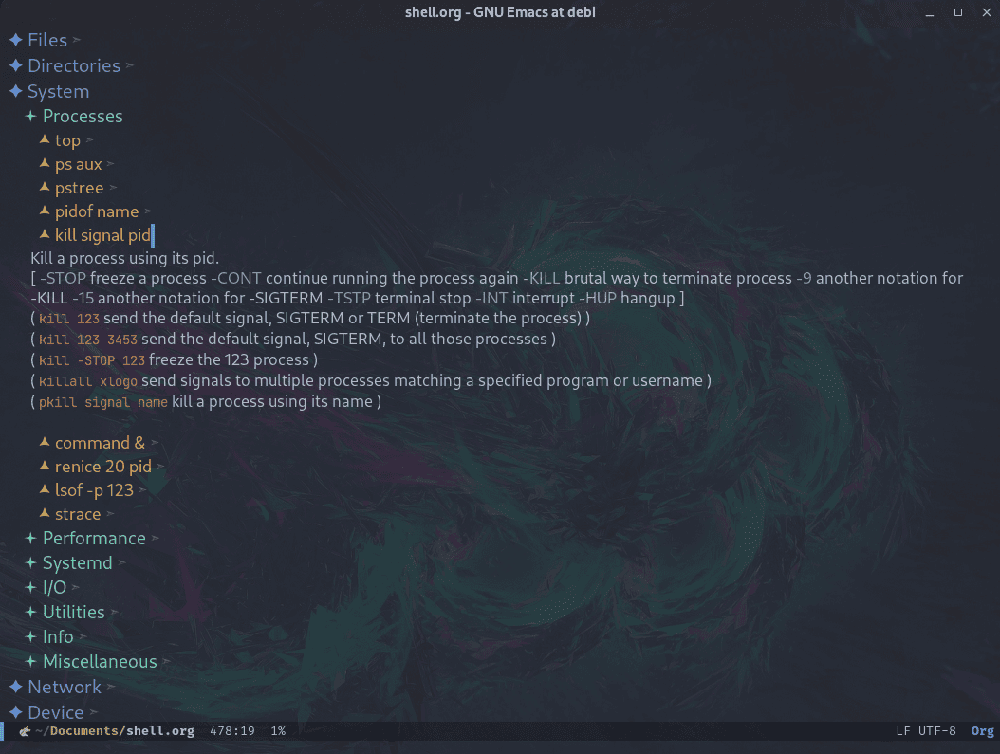
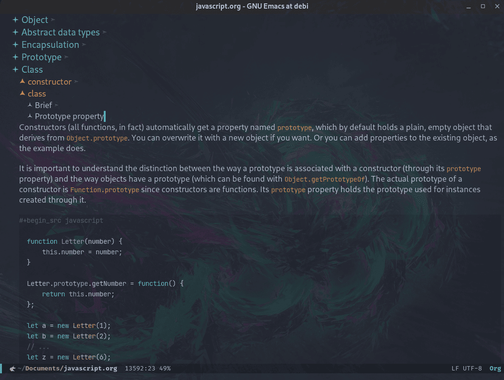
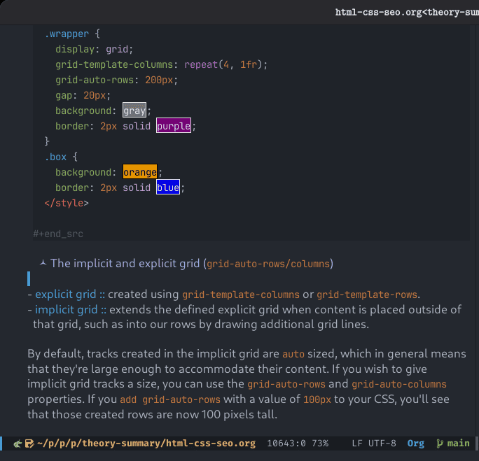
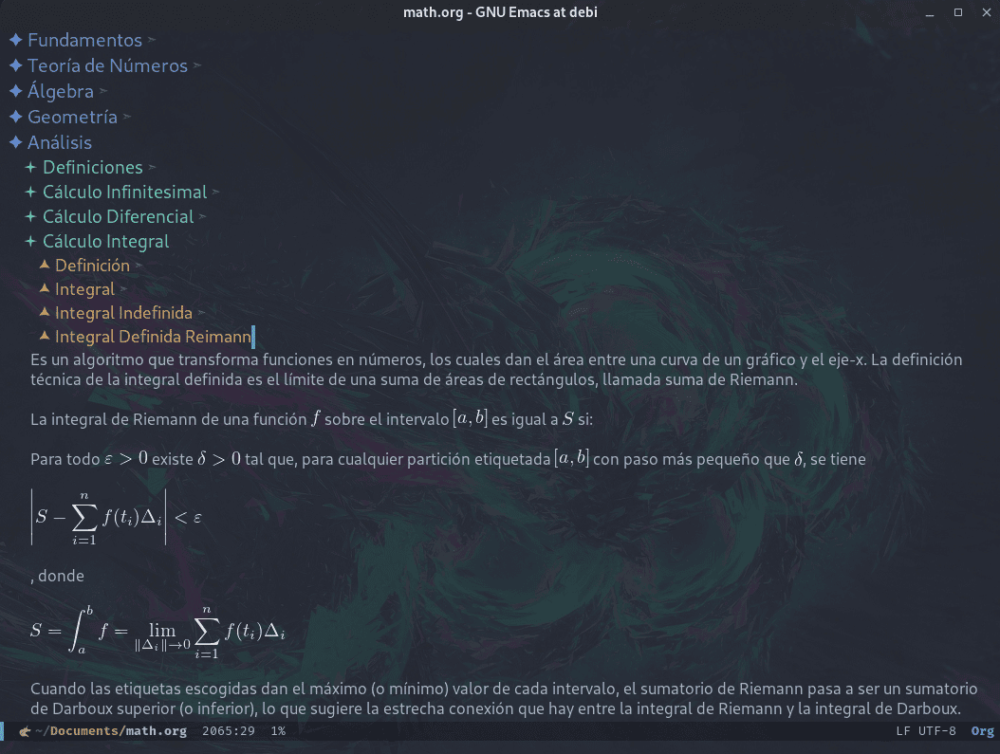

# #+title: Summary
#+date: 2025-03-28
#+author: Richard Frangie
#+language: en

#+html: 
#+html: 
#+html: 
#+html: 
#+html: 
#+html: 
#+html: 
#+html: 

* Overview
Configuration files and summaries highlighting what I consider the most essential topics for studying the fundamentals of computing and web development.

All the information collected and compressed here is completely free and accessible. It has been gathered from the internet through various means, such as documentation, books, articles, websites, etc., with appropriate references provided at the end of each file.

This was created for personal use, and self-documentation. It's shared here to keep a public backup, and in case someone might find it helful to see how to collect free resources, and how to structure, and organize the information using the powerful [[https://www.gnu.org/software/emacs/][GNU Emacs]] editor along with [[https://orgmode.org/][Org mode]].

* Interesting files
** [[file:init.org][Init]]
Emacs initialization file that containing personal EmacsLisp code for customizing [[https://www.gnu.org/software/emacs/][Emacs]]. The file is created using an approach similar to literate programming, which is more like self-documentation, and is organized into sections similar to those found in the builtin [[https://www.gnu.org/software/emacs/manual/html_node/emacs/Easy-Customization.html][Customize interface]]. It also includes some additional functions, as well as many of the most useful packages, specially the Minad Stack ([[https://github.com/minad/vertico][vertico]], [[https://github.com/minad/consult][consult]], [[https://github.com/minad/corfu][corfu]], [[https://github.com/minad/cape][cape]], [[https://github.com/minad/tempel][tempel]], [[https://github.com/minad/marginalia][marginalia]]), wich are amazing, and very well-designed packages.

** 
SVG file created in Inkscape showing all system keyboard shortcuts. Useful for keeping track of your keyboard shortcuts. You can play around with Inkscape to create or remove commands or with layers to show or hide commands (e.g. standard, emacs, system, ...) and keyboard layouts (e.g qwerty, dvorak, ...).

** [[file:shell.org][Shell]]
An extensive list of the most popular and useful commands in GNU/Linux, along with an introduction to the basics of command line use, and shell scripting. The content is primarily based on the book [[https://linuxcommand.org/tlcl.php][The Linux Command Line]], and the [[https://www.gnu.org/software/coreutils/manual/html_node/index.html][GNU Coreutils]] documentation. The commands are structured into sections with their abbreviated description, the most useful options, and related commands, which is very useful for quickly looking up commands using the [[https://orgmode.org/][Org]] header structure.

** [[file:javascript.org][JavaScript]]
Broad overview and summary of the JS language, covering generic aspects, logical structure, and some core components. The content is mainly based on the [[https://eloquentjavascript.net/][Eloquent JavaScript]] book, and the great series of articles by [[http://dmitrysoshnikov.com/][Dmitry Sóshnikov]]. One interesting feature of [[https://orgmode.org/][Org]] is that, in addition to plain text, it allows for the inclusion of source code examples using code blocks that format the syntax according to the programming language being used.

** [[file:emacs-elisp.org][Emacs Elisp]]
A great summary of the Elisp programming language, along with an overview of the main features and builtin modes of the [[https://www.gnu.org/software/emacs/][Emacs]] editor. Elisp is primarily used to customize and extend the functionality of Emacs. Additionaly, it includes a list of the most useful commands, functions, and packages, each accompained by a brief explanation. This content is based on primarily on the  [[https://www.gnu.org/software/emacs/manual/html_node/eintr/index.html][An Introduction to Programming in Emacs Lisp]] book, and [[https://www.gnu.org/software/emacs/manual/html_node/emacs/index.html][GNU Emacs Manual]].

** [[file:html-css-seo.org][HTML-CSS]]
Basic overview and examples of HTML, CSS, and other topics, based primarily on [[https://developer.mozilla.org][MDN]] website.

** [[file:math.org][Math]]
A simple and basic summary of elementary mathematical concepts. One of the advantages of [[https://orgmode.org/][Org]] mode is its support for embedding LaTeX code into its files. This feature allows you to easily process text to produce pretty output for mathematical symbols.

** [[file:tempel/][Templates]]
Set of templates for both text and programming languages. Made possible by the amazing [[https://github.com/minad/tempel][Tempel]] package. Creating them is tedious at first, but once created they are incredibly useful. Simply type the initials plus the spacebar and voilà! For example:

#+begin_src javascript

  // type the initials: c + o then the spacebar and it becomes ->
  console.log()

  // or for a comment template: c + o + m + SPC ->
  //=============================================================
  //
  //=============================================================

#+end_src

** [[file:devices/default.conf][Keyd]]
[[https://github.com/rvaiya/keyd][Keyd]] configuration file. Keyd is a mapping tool, not only for the keyboard, but also for the mouse and other devices. It's useful for modifying the behavior of individual keys, setting up layouts like Dvorak, creating macros, and enabling sticky keys.
